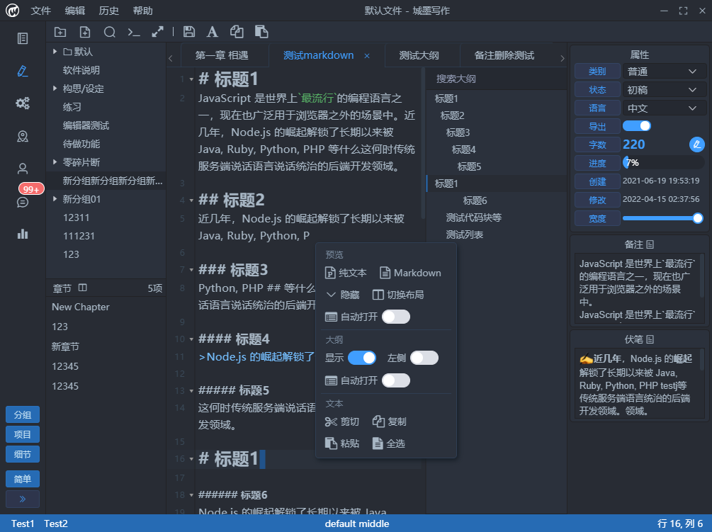

# chm-writer

## Screenshot

### Data Panel


### Writing Panel



### Character Panel


## Project setup

```cmd
yarn
```

### Compiles and hot-reloads for development

```cmd
yarn electron:serve
```

### Compiles and minifies for production

```cmd
yarn electron:build
```

### Lints and fixes files

```cmd
yarn lint
```

### Customize configuration

See [Configuration Reference](https://cli.vuejs.org/config/).
